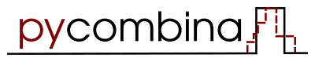

.. This file is part of pycombina.
..
.. Copyright 2017-2018 Adrian Bürger, Clemens Zeile, Sebastian Sager, Moritz Diehl
..
.. pycombina is free software: you can redistribute it and/or modify
.. it under the terms of the GNU Lesser General Public License as published by
.. the Free Software Foundation, either version 3 of the License, or
.. (at your option) any later version.
..
.. pycombina is distributed in the hope that it will be useful,
.. but WITHOUT ANY WARRANTY; without even the implied warranty of
.. MERCHANTABILITY or FITNESS FOR A PARTICULAR PURPOSE. See the
.. GNU Lesser General Public License for more details.
..
.. You should have received a copy of the GNU Lesser General Public License
.. along with pycombina. If not, see <http://www.gnu.org/licenses/>.

.. pycombina documentation master file, created by
.. sphinx-quickstart on Mon Dec  8 09:36:29 2014.
.. You can adapt this file completely to your liking, but it should at least
.. contain the root `toctree` directive.

|

pycombina - Combinatorial Integral Approximation
------------------------------------------------

|gitlab-ci|

.. |gitlab-ci| image:: https://www.w.hs-karlsruhe.de/gitlab/ab/pycombina/badges/master/pipeline.svg
    :target: https://www.w.hs-karlsruhe.de/gitlab/ab/pycombina/commits/master
    :alt: Gitlab CI pipeline status master branch

**pycombina** is a Python module for solving combinatorial integral approximation problems. Combinatorial integral approximation problems can be formulated and solved

1. by a custom Branch-and-Bound algorithm (using fast implementation in C++, recommended),
2. by SCIP (using an MILP formulation, requires SCIP and pyscipopt)
3. by Gurobi (using an MILP formulation, requires Gurobi and gurobipy)

while the problem setup is widely automatized. 

.. toctree::
   :maxdepth: 2
   :numbered:
   :caption: Contents

   install
   combina
   samples
